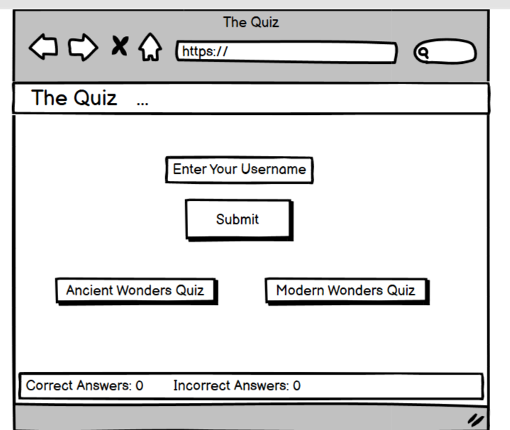
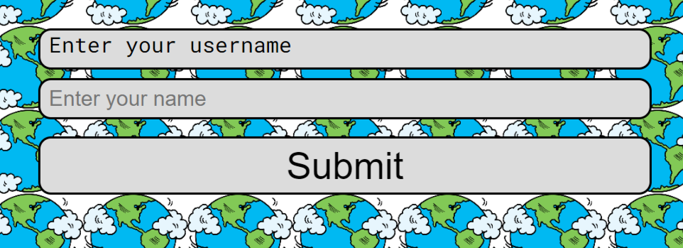

# Wonders Quiz

Wonders Quiz is a website designed for users to test their knowledge on both the modern wonders of the world and the ancient wonders of the world. The target audience for this quiz isn't limited by age however, it would maily appeal to people with an interest in architecture or history.

#### Link to live website can be found at [Wonders Quiz](https://regan-boreland.github.io/wondersquiz/).

# User Experience
## Wireframes
In the planning stage I used a wireframe app called [balsamiq](https://balsamiq.com/) to create the initial design of the website.

## User stories 
### First time user stories
* I want to be able to test my knowledge on both the modern wonders and ancient wonders of the world.
* I want to be able to enter a username and the website respond to my name.
* I want the website to tell me how many questions I got correct and incorrect.

### Returning user stories
* I want the questions to be random every time so I don't know the order and can test my ability to recall the information.

## Design choices
### Colour scheme

### Typography
I have chosen two fonts to use on the website, these are:
* 'Roboto Mono'
* 'Fjalla One'
# Features
## Existing features
#### Header

* The header for Wonders Quiz contains the title of the webpage, informing users what the website is called.
* The header/title also doubles as a way for users to reset the webpage if they choose to.

#### How to play instructions

* The "how to play section" is a small message telling the user the point system and giving them a small message reading "the questions won't be easy good luck!".

#### Lets play button

* The lets play button is a button element that contains the content "Lets Play".
* Upon clicking the lets play button the user will be have the ability to enter a username.

#### Username input

* The username input allows users to enter a username and the webpage will respond provided the username is between 2 and 9 characters.
* Upon entering the username the webpage will greet the user by their given name.

#### Greeting message

* Upon entering the username the webpage greets the user by their given name.
* This shows interactivity between the user and the webpage.

#### Start button

* The start button contains the content "test you knowledge" this is an encouragement for the user to start the game.
* Upon clicking the start button a container with the questions and answers will reveal itself.

#### Question and answer container

* The question & answer box is a container with the questions and answers.
* When the user has chosen an answer the webapge will respond with either a congratulations message or an unlucky message.

#### Correct answer response

* The correct answer response only appear if the user has selected the correct answer.
* To prevent the user from staying on the response a time has been set of 1.5 seconds, when that limit has been reached the response will disappear and then the new question will appear 0.5 seconds later.

#### Incorrect answer response

* The incorrect answer response appears if the user has selected the incorrect answer. Similar to the correct answer response, the incorrect answer response has a time limit set.
* If the incorrect answer response appears it will contain a small message and reveal the correct answer to the user.

#### Score container

* The score container is used to inform the user of both their correct and incorrect answers. 
* The score congtainer also informs users of what question they're on. The maximum questions on the quiz is 8.

#### Finish quiz alert

* The finish quiz alert informs the user that they have finished the quiz.
* The finish quiz alert also informs the user what their correct score out of the maximum number of questions.

#### Reset quiz alert

* The reset quiz alert is used to reset the webpage to its original viewpoint, with only being the title and the how to play content on the page. 
* The reset quiz alert also appears when the user clicks the title to reset the webpage.

## Future features
* I would like to add a scoreboard so users can see who has got the most questions right.
* I would like to add a difficulty section so the users can determine the quiz based on their knowledge.
* I would like to add quizes on other subjects.

# Acessibility
During the creation of the website I have kept accessibility in mind, I have done this by:
* Using semantic HTML.
* Ensuring the colours have sufficent contrast.
* Used a clear font that is easy to read. 

# Testing
All information regarding testing is on [testing.md](TESTING.md).
## Technologies used
* HTML5 - to build initial content and structure for the website.
* CSS - to add style to the content and website.
* JavaScript - to add interactivity to the website.
* GitHub - used to deploy the website.
* GitPod - used to build and edit the website.
* Sweet Alert - used to respond based on if the user got the answer correct or incorrect.

## Deployment
The website was deployed through github pages, the following steps are used to do this:
* In the GitHub repository go into the settings section and select pages under the subsection code and automation.
* Under the build and deployment section of the page select the main branch and make sure the folder selected is /(root).
* Save these settings and return to the code tab of the repository.
* Under the deployment section select the deployments link.
* View your live link.

## Local deployment
The steps to fork a repository are:
* Log in to Github (if you have an account, if not sign up for github) 
* Go to the repository for Wonders Quiz, [Regan Boreland/wondersquiz](https://github.com/Regan-Boreland/wondersquiz)
* Click fork on the right hand side of the screen (located between notifications and star/saved)

The steps to clone are:
* Log in to Github 
* Go to the repository for Wonders Quiz, [Regan Boreland/wondersquiz]( Log in to Github 
* Go to the repository for Apex MMA, [Regan Boreland/ApexMMA](https://github.com/Regan-Boreland/wondersquiz)
* Click on the code option and select what you would like to clone with, either: HTTPS, SSH or GitHub CLI. 
* Open the terminal in your selected code editor and change the current working directory to the location of where you want the cloned directory.
* Type "Git clone" into the terminal and press enter on your keyboard.)
* Click on the code option and select what you would like to clone with, either: HTTPS, SSH or GitHub CLI. 
* Open the terminal in your selected code editor and change the current working directory to the location of where you want the cloned directory.
* Type "Git clone" into the terminal and press enter on your keyboard. 

# Credits
## Content
* All icons were take from [font Awesome](https://fontawesome.com/).
* Background image was taken from [png arts](https://www.pngarts.com/explore/55278).
* The favicon was taken from [png arts](https://www.pngarts.com/explore/65804).

## Acknowledgment
* Mentor: Jubril Akolade
* [James Q Quick](https://www.youtube.com/watch?v=zZdQGs62cR8&list=PLB6wlEeCDJ5Yyh6P2N6Q_9JijB6v4UejF&index=3) - Used a YouTube video for guidance on how to display the questions and answers in their given area. 