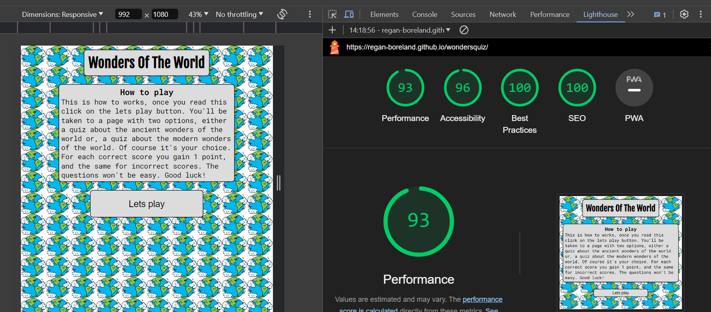

# Testing
## Validator testing
* No Errors were found on WC3 HTML Validator
* No Errors were found on WC3 CSS Validator
* No Errors were found on JSHint

Lighthouse on mobile phones:

lighthouse on iPads:

Lighthouse on small laptops:

Lighthouse on high resolution devices:

## Manual testing
### Full testing
The website has been tested on the following devices:
* IPhone 12 Pro
* IPhone 14 Pro Max
* IPad pro
* Asus Zenbook Duo

The website was tested on the following browsers:
* Google chrome
* Safari
* Microsoft Edge

### Testing user stories
`First time visitors`
| Goals | How are they achieved? |
| :--- | :--- |
| I want to be able to test my knowledge on both the modern wonders and ancient wonders of the world. | The wonders quiz offers a quiz on both the ancient wonders of the world and the modern wonders of the world |
| I want to be able to enter a username and the website respond to my name. | The wonders quiz includes an input element that will respond with the users name once the user has met the username requirements |
| I want the website to tell me how many questions I got correct and incorrect. | The wonders quiz has a scoring system that is presented at the bottom of the pages once the user has chosen a quiz. At the end of the quiz the users score will be presented to them. |

`returning users`
| Goals | How are they achieved? |
| :--- | :--- |
| I want the questions to be random every time so I don't know the order and can test my ability to recall the information. | The wonders quiz randomises the questions when the webpage is reloaded so the order won't be predictable. | 

### Testing features
`Index.html`
| Feature | Expected Outcome | Testing Performed | Result | Pass/Fail |
| --- | --- | --- | --- | --- |
| Header/title click | Resets the webpage with only the how to play content and the lets play button revealed | Clicked the header/title | Resets the webpage with only how to play content and lets play button on the page | Pass |
| Lets play button click | Reveals the username input and username submission | Clicked lets play button | Displays username input and username submission | Pass |
| Username submission | Greets the user with their given username and reveals another button to start the quiz | Clicked username submission button | Greets user and presents the start quiz button | Pass |
| Test your knowledge button | Starts the game and gives user the first question and potential answers. Shows the score container at the bottom of the page | Clicked on the test you knowledge button | Presents user with first question and potential answers. | Pass |
| Answer/option buttons | If the chosen answer is correct the user will be presented with an alert that they have got the question correct. If the incorrect answer is chosen the user will be presented with an alert that the selected answer is wrong. | Clicked the correct and incorrect answer. | Both the correct and incorrect answer alerts were presented. | Pass |
| Finish quiz alert | Once the quiz has been finished the user should get an alert that shows their score out of 8 | Finished the quiz | Alert tells user their score out of 8 | Pass |
| Webpage reset alert | Resets the webpage to its original status | Clicked the accept on the reset quiz alert | User is presented with the original status of the page. | Pass |

### Fixed bugs
| Bug | Solution |
| ---| ---|
| script.js was not linked to index.html correctly | changed href attribute to src attribute |
| onclick function linked to h1 elements reveals all elements rather than just the pregame message and the lets play button. | wrote a seperate function to reset the webpage rather than using an existing function. |
| quizQuestions array was not recognised by the console. | Had to rename the array as the name was used elsewhere. |
| when moving onto a question the previous selected answer remains highlighted. | Instead of using user feedback of colour change I decided to use Sweet Alerts to inform the user if their selected answer was correct or incorrect. |
| After adding label for input element submit username function wouldn't progress through the webpage. | Add aria-label to username input. |

### Unfixed bugs
No unfixed bugs